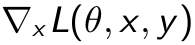
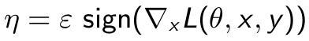
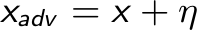
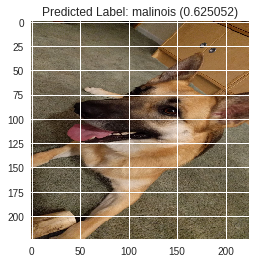
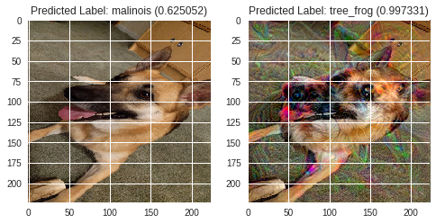
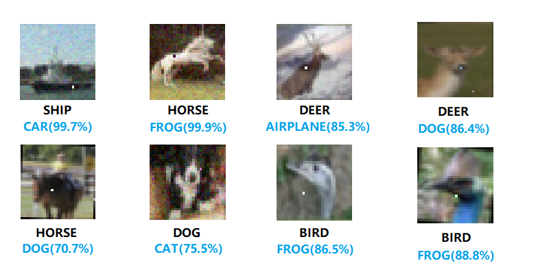
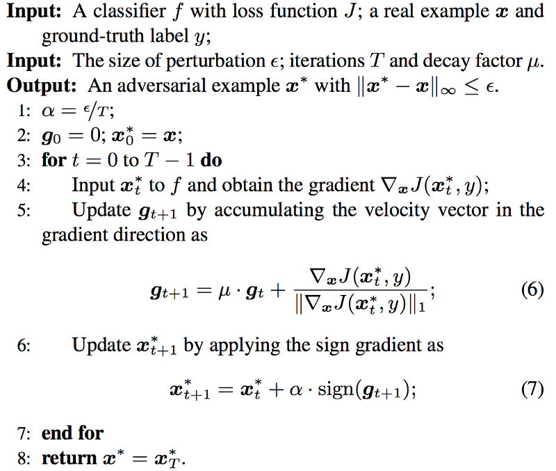
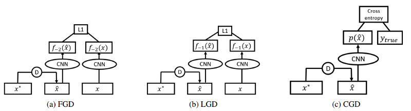

***************************
Project: Adversarial Attack
***************************

.. contents::
	:local: 

.. _adversarial attack:

==================
Adversarial Images
==================

Adversarial images are images that fool state of the art image classifiers, but human would easily classify the image as the proper class. At present, these images are only possible with access to the classifier you aim to fool.

=======
Methods
=======

There are a couple useful methods in adversarial attacks. In this article, we explore the robustness, the changed pixel count (p-hash) of the methods, and the computational feasability of the attack. There is a very important terminology in the field of attack: whether the attack is white box or black box. In white box attacks the attacker has access to the model’s parameters, while in black box attacks, the attacker has no access to these parameters (uses a different model or no model at all to generate adversarial images)

Attacks covered:

* Fast Gradient Sign, Targeted [https://arxiv.org/abs/1412.6572] (White box)
* Gradient Ascent, Adversarial Images, Targeted (White box)
* One pixel attack, Targeted [https://arxiv.org/abs/1710.08864] (White box)
* Winning attacks at NIPS 2017 competition, MI-FGSM (Both White and Black Box)

Defense covered: 

* Winning defense at NIPS 2017 competition

.. _fast gradient sign:

==================
Fast Gradient Sign
==================

One of the most classic adversarial attacks is no other than the one proposed by Goodfellow et al.

Let x be the original image, y the class of x, θ the weights of the network and L(θ, x, y) the loss function used to train the network.

First, we compute the gradient of the loss function according to the input pixels.

We are only interested in the sign of the slopes to know if we want to increase or decrease the pixel values. We multiply these signs by a very small value ε to ensure that we do not go too far on the loss function surface and that the perturbation will be imperceptible. This will be our perturbation.

Our final image is just our original image to which we add the perturbation η.

Additional Info: https://towardsdatascience.com/adversarial-examples-in-deep-learning-be0b08a94953
https://medium.com/onfido-tech/adversarial-attacks-and-defences-for-convolutional-neural-networks-66915ece52e7

===============
Gradient Ascent
===============

We first initialized the tenserflow instance.

.. code::

	import keras
	from keras import backend as K
	from keras.utils.generic_utils import CustomObjectScope
	from keras.models import load_model
	from keras.applications import inception_v3
	from keras.preprocessing.image import img_to_array, array_to_img
	from keras.applications.mobilenet import preprocess_input
	from PIL import Image
	import numpy as np
	import scipy
	import matplotlib.pyplot as plt
	%matplotlib inline

Utilitiy Functions Implemented by referencing keras source code.

.. code::
	
	def prepare_image(image, target=(224,224)):
    # if the image mode is not RGB, convert it
    if image.mode != "RGB":
        image = image.convert("RGB")

    # resize the input image and preprocess it
    image = image.resize(target)
    image = img_to_array(image)
    image = np.expand_dims(image, axis=0)
    image = preprocess_input(image)
    # return the processed image
    return image

	def deprocess_image(x):
	    # Util function to convert a tensor into a valid image.
	    x=np.copy(x)
	    if K.image_data_format() == 'channels_first':
	        x = x.reshape((3, x.shape[2], x.shape[3]))
	        x = x.transpose((1, 2, 0))
	    else:
	        x = x.reshape((x.shape[1], x.shape[2], 3))
	    x /= 2.
	    x += 0.5
	    x *= 255.
	    x = np.clip(x, 0, 255).astype('uint8')
	    return x

	def eval_loss_and_grads(x,clz, loss_func):
	    outs = loss_func([x,clz])
	    loss_value = outs[0]
	    grad_values = outs[1]
	    return loss_value, grad_values

	def resize_img(img, size):
	    img = np.copy(img)
	    if K.image_data_format() == 'channels_first':
	        factors = (1, 1,
	                   float(size[0]) / img.shape[2],
	                   float(size[1]) / img.shape[3])
	    else:
	        factors = (1,
	                   float(size[0]) / img.shape[1],
	                   float(size[1]) / img.shape[2],
	                   1)
	    return scipy.ndimage.zoom(img, factors, order=1)

	def gradient_descent(x, iterations, step, clz=None, max_loss=None, loss_func=None):
	    for i in range(iterations):
	        loss_value, grad_values = eval_loss_and_grads(x, clz, loss_func)
	        if max_loss is not None and loss_value > max_loss:
	            break
	        print('..Loss value at', i, ':', loss_value)
	        x -= step * grad_values 
	    return x

Initialize Tensorflow & Load Models with Imagenet Weights

.. code::

	K.set_learning_phase(0)
	model = inception_v3.InceptionV3(weights='imagenet',include_top=True)

Load Images

.. code::
	
	orig_img = Image.open('trixi.png')
	orig_img = prepare_image(orig_img)
	print (orig_img.shape)

Utility function to show the origional prediction

.. code::

	top_predicted_label = inception_v3.decode_predictions(model.predict(orig_img), top=1)[0][0]
	plt.title('Predicted Label: %s (%f)' % (top_predicted_label[1], top_predicted_label[2]))
	plt.imshow(deprocess_image(orig_img))

Set the target to tree frog, and write the utility function for the losses

.. code::

	tree_frog = np.zeros_like(model.predict(orig_img))
	tree_frog[0,31] = 1.
	inception_v3.decode_predictions(tree_frog)
	from keras import losses
	# Variable fake class
	input_class = K.zeros(shape=(1,1000)) 

	# Choose a few layers at random and sum their L2 norms, computing the dreaming loss
	dream_loss = K.variable(0.)
	np.random.seed(1)
	np.random.choice(model.layers[:-1], size = 5)
	for x in np.random.choice(model.layers[:-1], size = 4):
	    x_var = x.output
	    dream_loss += np.random.uniform(0,2) * K.sum(K.square(x_var)) / K.prod(K.cast(K.shape(x_var), 'float32'))

	# adversarial loss
	adversarial_loss = losses.categorical_crossentropy(input_class, model.output)

	# final loss
	adversarial_dream_loss = adversarial_loss-dream_loss

	# Compute the gradients of the dream wrt the loss.
	dream = model.input # This is the input image

	grads = K.gradients(adversarial_dream_loss, dream)[0] # the signs will acheive the desired effect
	grads /= K.maximum(K.mean(K.abs(grads)), K.epsilon()) # Normalize for numerical stability
	outputs = [adversarial_dream_loss, grads]

	# Function to use during dreaming
	fetch_loss_and_grads = K.function([dream, input_class], outputs)

Perform the attack

.. code::

	step = 0.01  # Gradient ascent step size
	num_octave = 5  # Number of scales at which to run gradient ascent
	octave_scale = 1.2  # Size ratio between scales
	iterations = 15  # Number of ascent steps per scale
	max_loss = 100.

	img = np.copy(orig_img)

	if K.image_data_format() == 'channels_first':
	    original_shape = img.shape[2:]
	else:
	    original_shape = img.shape[1:3]
	successive_shapes = [original_shape]
	for i in range(1, num_octave):
	    shape = tuple([int(dim / (octave_scale ** i)) for dim in original_shape])
	    successive_shapes.append(shape)
	successive_shapes = successive_shapes[::-1]
	original_img = np.copy(img)
	shrunk_original_img = resize_img(img, successive_shapes[0])

	for shape in successive_shapes:
	    print('Processing image shape', shape)
	    img = resize_img(img, shape)
	    print(img.shape)
	    img = gradient_descent(img,iterations=iterations,step=step,clz=tree_frog,max_loss=max_loss,loss_func = fetch_loss_and_grads)
	    print(img.shape)
	    # Upscale
	    upscaled_shrunk_original_img = resize_img(shrunk_original_img, shape)
	    print(upscaled_shrunk_original_img.shape)
	    same_size_original = resize_img(original_img, shape)
	    print(same_size_original.shape)
	    # Add back in detail from original image
	    lost_detail = same_size_original - upscaled_shrunk_original_img
	    img += lost_detail
	    
	    shrunk_original_img = resize_img(original_img, shape)

Comparison between predict and outcome.

================
One pixel attack
================

	One pixel attack for fooling deep neural networks, Jiawei Su et al.

By changing only one pixel in an image that depicts a horse, the AI will be 99.9% sure that we are seeing a frog. 
How is such attack possible? As explained above, neural networks produce a bunch of confidence values in order to come to a conclusion. We have to know which pixel position to choose from and what color do we want. We approach this by performing a bunch of random changes to the image and checking how each of these changes performed in decreasing the confidence of the network in the appropriate class. And then the network continue its search around the most promising attacks. Just like many other attacks, the one pixel attack use differential evolution, and it has turned out to be amazingly effective

==========================================
Boosting Adversarial attacks with Momentum 
==========================================

This method makes use of momentum to improve the performance of the iterative gradient methods, as described in the following algorithm. 

	Momentum psudocode, adapted from the origional paper.

The results show that this method outperforms all other methods in the competition and shows good transferability results, performing well in black box attacks as seen in the figure below.

.. figure:: ../_static/momentum-result.png
	:align: center
	:width: 50%

	Momentum result, adapted from the origional paper.

=========================================
Winning defences at NIPS 2017 competition
=========================================

The high level representation guided denoiser is built on the principle that the adversarial pertubation are amplified throught the network. So the team introduced several high level denoiser such as a feature guided denoiser (FGD), a logits guided denoiser (LGD) and a class label guided denoiser (CGD).

A pretrained CNN is also used for the guidance of the denoiser's training process. For example, the FGD use the response from the last feature layer of the CNN in order to improve its denoising ability. Similarly, the LGD use logits activation of the CNN and the CGD use the classification output.

	
	Denoiser architecture, adapted from the origional paper.

Visit their github repo here: https://github.com/lfz/Guided-Denoise