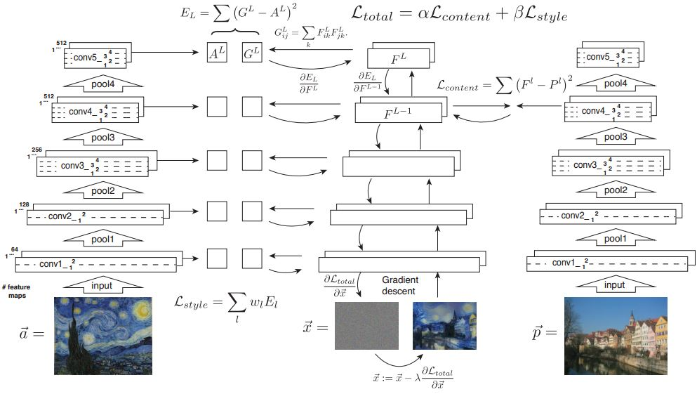
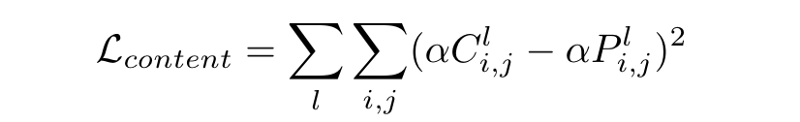
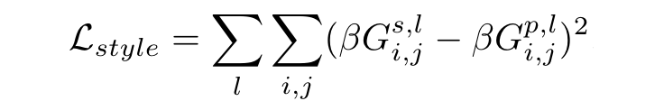
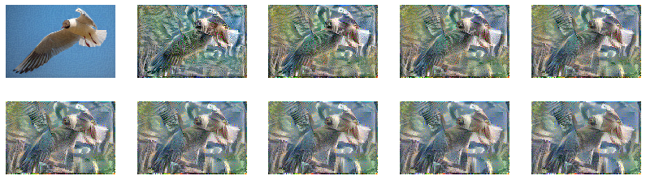
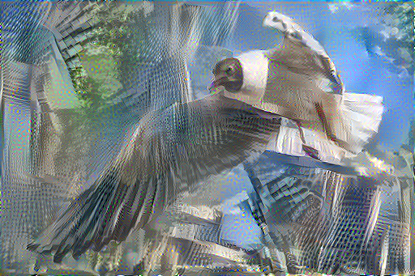
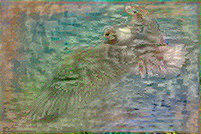
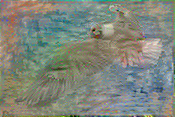
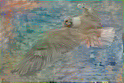
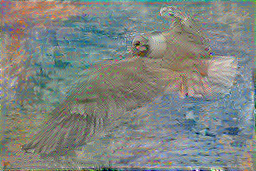
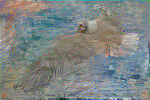

.. _neural style:

******************************
Project: Neural Style Transfer
******************************

.. contents::
	:local: 

================
CNN Architecture
================

The overall architecture for the neural network that's being used is the same as VGG-19, which consists of 5 pooling layers for downsampling and several convolutional layers.

	VGG-19 Architecture, from Image Style Transfer Using Convolutional Neural Networks Gatys et al.

====================
Optimization Methods
====================

We do not use a neural network in a "true sense", that is, we aren't really training the network to do anything in specific. We're simply taking advantage of the backpropagation to minimize two defined loss values. The tensor which we backpropagate into is the stylized image. We input the picture that we want to transfer the style onto, the "content image", as well as the "style image" from which we want to extract the patterns. We want to initialize the tensor to be random noise. The tensor, along with the content and style images, are then passed through several layers of a network that is pretrained on image classification. We use the outputs of various intermediate layers to compute style loss and content loss. That is, how close is the image to the style image in style, and how close is the image to the content image in content. Those losses are then minimized by directly changing the image.

======
Losses
======

We use the outputs of intermediate layers of a pretrained image classification network to compute our style and content losses. For a network to be able to do image classification, it has to understand the image, and the process of taking the image as input and outputting its guesses is useful to us. In such processes, the neural network is essentially doing transformations to turn the image pixels into an internal understanding of the "content".

Content Loss
============

When we pass both the altered image and the content image through some layers of an image classification network and find the Euclidean distance between the intermediate representations of those images, the resulting value is the content loss. This can be evaluated by the following equations.

Style Loss
==========

Style loss contains information on how close the altered image is in style to the style image. It is evaluated by finding the Euclidean distance between the Gram matrices of the intermediate representations of the altered image and the style image.

======
Result
======

`Source image <https://jerrywang.website/photo/Here_I_Am,_Riding_The_Sky>`_, taken by Jerry Wang.

Style Image 1: Shinkai Makoto's Drawing

Style Image 2: Claude Monet, Sunrise

.. |1| image:: ../_static/IMG_1062.JPG
	

	
.. |3| image:: ../_static/sunrise.jpg
	

.. csv-table::
	
	|1|,|2|,|3|

Source + Shinkai

	

	Final at 2500 iteration

Source + Monet

	At 250 iteration

	At 500 iteration

	At 750 iteration

	At 1000 iteration

	At 1500 iteration

	At 1750 iteration

=============
Related Works
=============

We would like to thank `Gatys et al`_ for their work that inspired this project.

.. _Gatys et al: https://arxiv.org/pdf/1508.06576.pdf