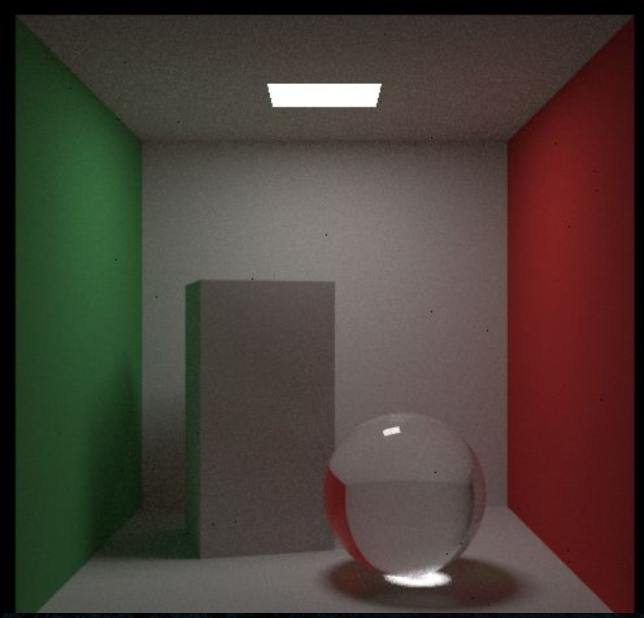

.. _ray tracer:

********************
Project: Ray Tracing
********************

.. contents::
	:local: 

===========================
Axis-Aligned Bounding Boxes
===========================

For better performance, a good bounding volume structure is necessary. Axis-Aligned Bounding Boxes provides a very nice and quick approach for detecting ray collision. We only need to care about whether the object has been hit, and not the point or the normal for that object. The biggest issue with using AABBs is that they need to be recreated every time the object changes orientation. Fortunately, we do not have to consider that issue in a "offline" ray tracer.

Most people use the “slab” method, which is based on the observation that an ​n​-dimensional AABB is just the intersection of ​n​ axis-aligned intervals.

For a ray to hit one interval we first need to figure out whether the ray hits the boundaries. For example, this is the ray parameters ​t0​ and ​t1 in 2D.

	Photos adapted from P. Shirley's Book

In 3D, those boundaries are planes. The equations for the planes are ​x = x0​, and ​x = x1​. 
Now the question become where does the ray exactly hit that plane? 
Well, ray can be thought of as just a function that given a ​t returns a location ​p​(​t​):

.. math::

	p​(t) = ​A​ + t​B

That equation applies to all three coordinates.

The key observation to turn that equation into a hit test is that the t-intervals need to
overlap for each "hit".

The pseudocode would be something like

compute (tx0, tx1)
compute (ty0, ty1)
return overlap?( (tx0, tx1), (ty0, ty1))

This is incredibly simple, and the fact that it still works in 3D is exactly why we love it.

===========
Motion Blur
===========

.. figure:: ../_static/motion_blur.jpg
	:align: center
	:width: 50%

	Test scene with motion blur

The secret of a successful Motion Blur implementation is in the ray tracer's camera implementation. We generate rays at random times while the shutter is open and intersect the model at that one time. Although the object is moving, each ray we generate exist at exactly one time. This way the core of the ray tracer can just make sure the objects are where they need to be for the ray. This method is introduced by Rob Cook in 1984.

=====================
Solid Texture Mapping
=====================

A ​texture​ in graphics usually means a function that makes the colors on a surface procedural. 
We can create a checker texture by simply multiply trig functions in all three dimensions, and the sign of that product forms a 3D checker pattern.
We first make ​all colors​ a texture, then we can make textured materials by replacing the vec3 color with a texture pointer:

.. code::

	class texture {
	public:
	    virtual vec3 value(float u, float v, const vec3 &p) const = 0;
	};

	class constant_texture : public texture {
	public:
	    constant_texture() {}

	    constant_texture(vec3 c) : color(c) {}

	    virtual vec3 value(float u, float v, const vec3 &p) const {
	        return color;
	    }

	    vec3 color;
	};

============
Perlin Noise
============

To get cool solid textures, most people use some form of noise. One of the most used noise is Perlin noise, named after inventor Ken Perlin.
I used Andrew Kensler's explaination of perlin noise to implement the perlin texture (http://eastfarthing.com/blog/2015-04-21-noise/).

A great thing about perlin noise is that its repeatable: it takes a 3D point as an input and always return some random number. In addition, Nearby points return similar numbers, and this is important when we're making a "pattern". Perlin noise is simple and very fast, I 

We first tile all of space with a 3D array of random numbers and use them in blocks. We then use hashing to scramble the arrangement of the tiles.

	After Scramble

To make it smooth, we linearly interpolate, and we get this:

	After Linear Interpolation

Looks nice! but there are obvious grid features in there. We call these "Mach bands",​ a known perceptual artifact from linear interpolation. To get rid of the Mach Bands, we use ​hermite cubic​ to round off the interpolation:

	After Hermite Cubic

=====================
Rectangles and Lights
=====================

From P. Shirley's book:
First, here is a rectangle in an xy plane. Such a plane is defined by its ​z​ value.
For example, ​z = k​. An axis-aligned rectangle is defined by lines ​x=x0​, ​x=x1​, ​y=y0​, ​y=y1.​

	Photos adapted from P. Shirley's Book

To determine whether a ray hits such a rectangle, we first determine where the ray hits the plane.
A ray P(t)=a+t*b has its z component defined by :math:`z(t)=az+t*bz` .
We can then solve for what the t is when z = k : :math:`t = (k-az) / bz`.
Once we have ​t​, we can plug that into the equations for ​x​ and ​y.
It is a hit if ​x0 < x < x1​ and ​y0 < y < y1​

=======
Volumes
=======

One thing nice to add to the ray tracer is smoke. This is sometimes called "volume". A very nice approach is to make a volume a random surface. A bunch of smoke/fog can be replaced with a surface that probabilistically might or might not be there at every point in the volume.

Think about a volume of constant density. A ray going through a volume can either scatter inside or make it all the way through. How far the ray has to travel through the volume plays a role in determining how likely it is for the ray to make it through.

The probability that the ray scatters in any small distance dL can be represented by a differential equation:

.. math::

	probability = c*dl

where C is porportional to the density of the volume.

=======================
Schlick's Approximation
=======================

In the process of building a ray tracer, we initially used the full Fresnel equations, 

	From Wikipedia

These looked absolutely horrible, and because polarization doesn't matter that much for most appearance, most ray tracers use R = (Rs+Rp)/2. It turns out there are a very nice simple approximation proposed by Christophe Schlick.
According to Schlick's model, the specular reflection coefficient R can be approximated by:

.. math::

	R(\theta) &= R_0 + (1 - R_0)(1 - \cos \theta)^5 \\
    R_0 &= \left(\frac{n_1-n_2}{n_1+n_2}\right)^2

=================
Nice Hack: de_nan
=================

	Photos adapted from P. Shirley's Book

A serious practical limitation of ray tracing algorithms is that they are often very sensitive to numerical precision. 

If there is bad or white "acnes", that means a bad might have killed a whole pixel. The sample might be NaN or a huge number. Peter Shirley introduces a nice hack in his third book of the Ray Tracing series. He mentioned that any "if" statement test with a NaN in it is false. This means we can apply a nice trick.

.. code-block:: cpp

	inline vec3 de_nan(const vec3 &c)
	{
	    vec3 t = c;
	    if(!(t[0]==t[0]))
	        t[0]=0;
	    if(!(t[1]==t[1]))
	        t[1]=0;
	    if(!(t[2]==t[2]))
	        t[2]=0;
	    return t;
	}