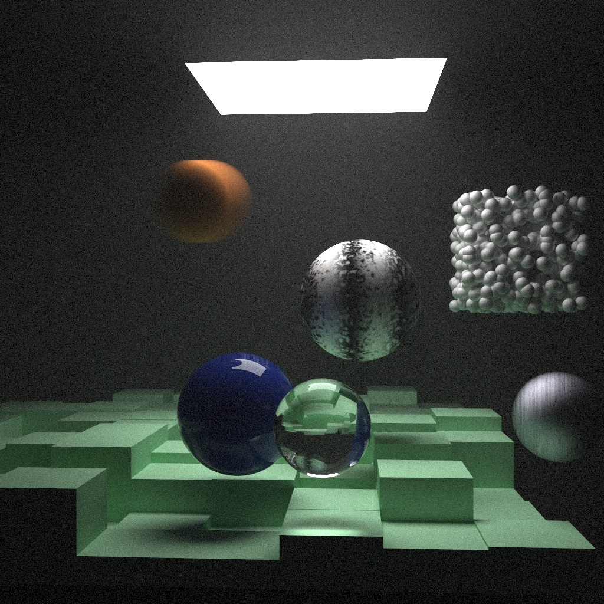
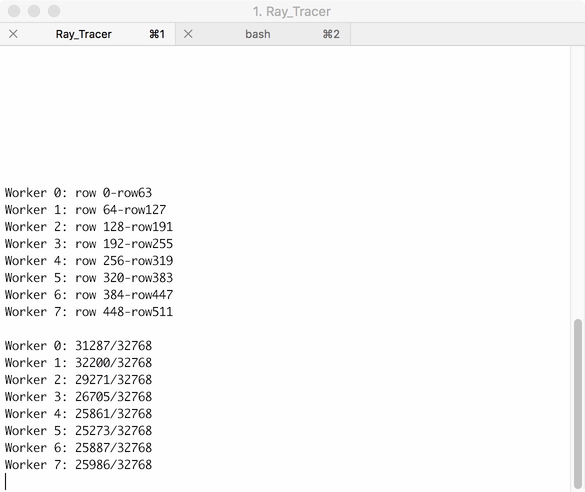
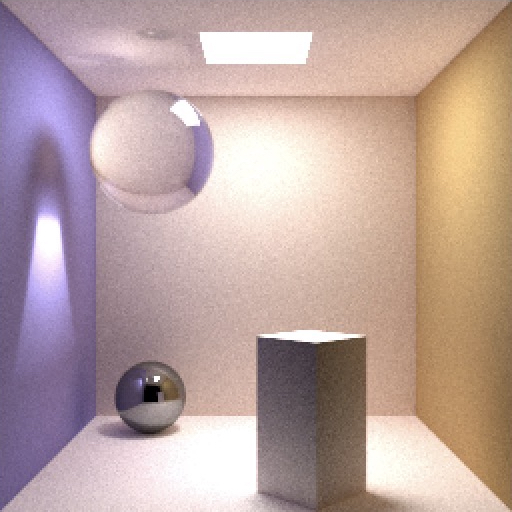
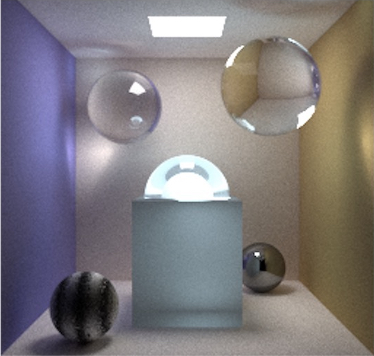
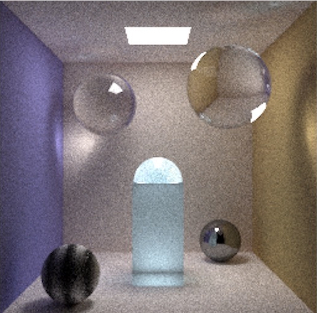
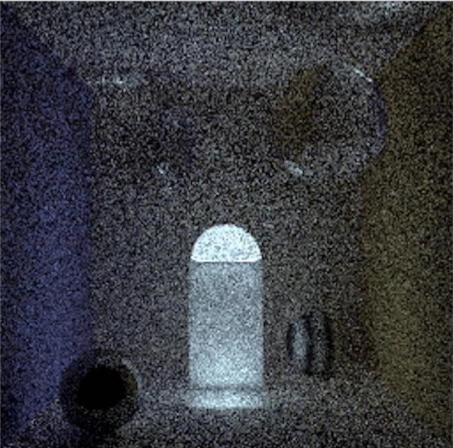
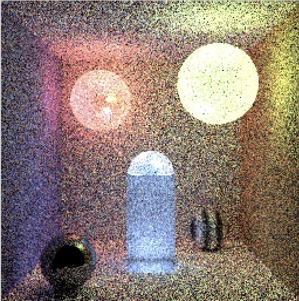

=======
Week 10
=======

.. contents::
	:local:

Class 1
=======

Monday, Nov. 12. Supervised by Ms. Healey.

So, sadly, we realized that our three.js scene doesn't work. Well actually, it's more like the shader doesn't work. Either way, the shader and the scene doesn't go together because of the internal design of GLSL and three.js. GLSL is not designed to handle a huge amount of calculation in a short period of time. So, whenever the shader is run, the browser crashes. 

That means we have to switch path to something different and faster. Well, C++ it is. So we made a ray tracer in C++. 

A day later, we found a fatal (well, not really fatal) flaw in the code of our ray tracer. That is, it was rendering an image using a single process. So we changed the source code so it uses multiple processes, depending on how many CPU cores the platform computer has.

In addition to that, we have realized that a single computer may not be fast enough for our purpose. So we give the ray tracer an ability to be run distributed –– that is, to render different parts of the same image on multiple computers to speed up the process. 

We rendered a test image. The scene is copied from our textbooks, *Ray Tracing In One Weekend* and *Ray Tracing The Next Week*. This image takes about 18 hours to render, with a total of 1104 geometry objects in the image, distributed to 

- 1 laptop with 4 cores (8 threads) 4GHz Xeon CPU.
- 2 laptops with 4 cores (8 threads) 3GHz i7 CPU.
- 12 desktops with 4 cores (4 threads) 2.5 GHz i5 CPU.
- 1 cloud server with 4 cores (8 threads) 3GHz vCPU.

So all we need to do is to port the design to the the new tracer. 

Class 2
=======

We spent some time giving the ray tracer a nice command line progress monitor

	
	The user interface

As for the scene, we found it's kind of boring to simply port the designed three.js scene into the shader. Plus, three.js doesn't have the ability to compute the color difference as a result of non-white light source. But our shader does. So we went through a few iterations of designing the scene. Some images are noisy because it takes about at least an hour to render a decent looking image. So usually we only do a quick render (which takes about 5 minutes) with low image quality to get a sense of how the image looks like.

	Iteration 1

	Iteration 2

	Iteration 3

	Iteration 4

	Iteration 5

.. _final:

============
Final Result
============

The image takes about 36 hours to render, with 23 geometric objects, distributed to

- 1 laptop with 4 cores (8 threads) 4GHz Xeon CPU.
- 2 laptops with 4 cores (8 threads) 3GHz i7 CPU.
- 28 desktops with 4 cores (4 threads) 2.5 GHz i5 CPU.

Approximately, 1.31 trillion float point arithmetics are performed to render this image. 

.. math::
	\begin{align}
	\text{number of rays}=\underset{1024}{\text{width}}\times\underset{1024}{\text{height}}\times\underset{50000}{\text{samples per pixel}}&=5.24\times10^{10}\\ \text{calculations per ray}=\underset{~10}{\text{ray tracing depth}}\times\underset{~2.5}{\text{overhead}}\times\underset{3}{\text{dimension}}\times\underset{3}{\text{color channels}}&\approx 225\\
	\text{number of rays}\times\text{calculations per ray}&=1.17\times 10^{13}
	\end{align}

.. note:: For a complete implementation and technological details of the ray tracer, please refer to :ref:`ray tracer`.

And here is our final result

.. image:: ../_static/final.jpg
	:align: center
	:width: 100%

An image in ppm format is also available at `here <../_static/final.ppm>`_.

The source code of the ray tracer is at `here <https://github.com/pkqxdd/ray-tracer-dist>`_

This concludes our directed study in rendering algorithms.
