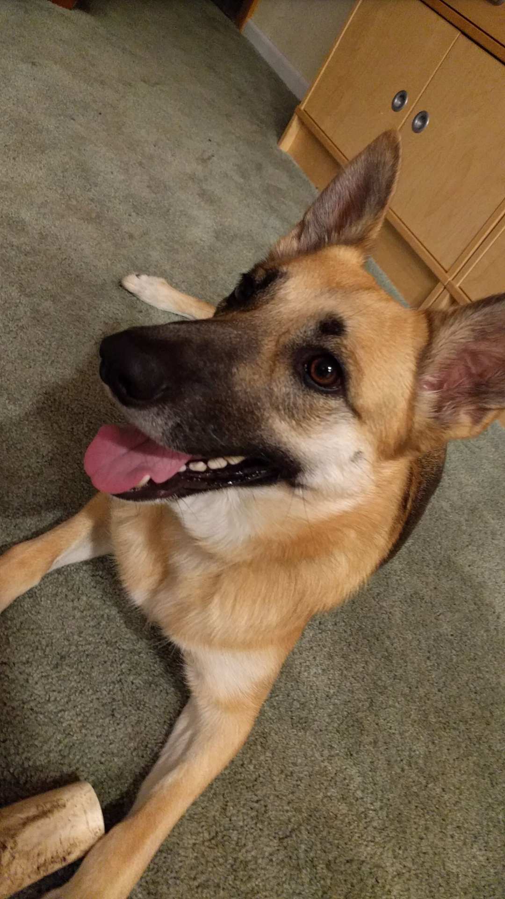

======
Week 4
======

.. contents::
	:local:

Class 1
=======

Monday, Oct. 1. Supervised by Ms. Healey.

We have decided to do a midterm project about attacking an image recognition neural network for better understanding of the how images, GPU and matrices work. The goal of the project is to have a neural network to recognize the picture of a dog as a tree-frog while humans still recognizing the picture as a dog.

	Target image.

This image has been recognized as a German Shepherd with 53% of confidence with the neural network. We cannot modify the neural network. All we can do is to modify the image. This project, in addition to being useful to computer graphics, is very useful in real life in that it is a simple manifest of the possible attacks on the image recognition networks, such as the governmental facial recognition network or the street signs recognition network on a auto-piloted car. This is partly the reason why we picked this as our midterm project.

Class 2
=======

Wednesday, Oct. 3. Supervised by Ms. Healey.

Continuing researching common vulnerabilities of Convolutional Neural Network (CNN).
The first method we looked into was one-pixel attack. This is a promising and very common method to attack neural network. However, one pixel attack is designed for non-targeted attack. A non-targeted attack differs from targeted attack in the primary goal of the attacks. In a non-targeted attack, the primary goal is to make the neural network recognize objects wrongly. There isn't a requirement on what it should end up being. Take our project as an example, a non-targeted attack would require the distorted image to be recognized as something that's not dog, be it an electric pole or a frog or an apple. A targeted attack would ask require the image to be recognized as a specific object, and in our case a tree-frog. It may seem that targeted attack is more powerful than a non-targeted attack and that there is no reason to do a non-targeted attack. In fact, targeted attack is a subset of non-targeted attack and is indeed more powerful. However, non-targeted attack require very minimal change in the target image and may require, as the name of one pixel attack suggests, only changing a single pixel in an image.

We have tried to fit the one-pixel attack on our model, and it worked...well, kind of. The confidence of recognizing the image as a tree-frog increased dramatically –– it went from about :math:`10^{-9}%` to 0.13%, after running the program for 2 hours. There wasn't a significant increase in confidence after it hit 0.13%. Obviously that's not enough. So, failed.

The second method we looked into was using clever-hans. This didn't work because, our targeted neural network is a mobile net, which isn't compatible with the cleverhans library. The characteristic of mobilenet is that all output images are of fixed size, in our case :math:`241\times 241` pixels. We even attempted to modify the clerver-hans library so it fit the dimension of the image. However after many modifications in the library it still doesn't work correctly –– the program wouldn't even run. After fixing errors after errors for at least 5 hours, we decided to give up.
